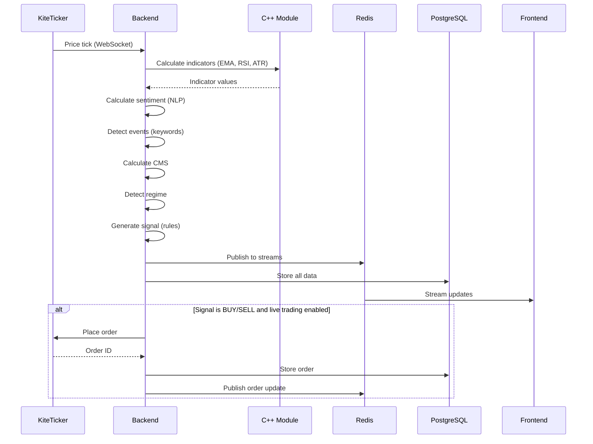

# Design Document: Explainable Algorithmic Trading System (EATS)

## Overview

The Explainable Algorithmic Trading System (EATS) is a production-grade, research-oriented algorithmic trading platform that combines NLP-based sentiment analysis, technical indicators, market regime detection, and composite scoring to generate transparent, rule-based trading signals. The system is designed for both backtesting and live trading via Zerodha Kite Connect API.

### Key Design Principles

1. **Explainability**: Every trading decision is traceable to specific rules and component scores
2. **No ML Training**: Uses lexicon-based NLP and rule-based logic only
3. **High Performance**: C++ acceleration for compute-intensive operations
4. **Modularity**: Loosely coupled microservices communicating via Redis
5. **Research-Friendly**: Comprehensive logging and data storage for analysis
6. **Production-Ready**: Safety controls, error handling, and monitoring

### Technology Stack

- **Backend**: Python 3.11+ with FastAPI
- **Database**: PostgreSQL 15+ with TimescaleDB extension
- **Cache/Streaming**: Redis 7+ with Pub/Sub
- **Acceleration**: C++ 17 with pybind11 bindings
- **Frontend**: React 18+ with Tailwind CSS and Recharts
- **NLP**: VADER sentiment analyzer
- **Trading API**: Zerodha Kite Connect Python SDK
- **Deployment**: Docker Compose with multi-stage builds

## Architecture

### High-Level Architecture


```
┌─────────────────────────────────────────────────────────────────┐
│                        React Dashboard                          │
│  (Price Charts, Sentiment, CMS, Signals, Backtest Results)     │
└────────────────────────┬────────────────────────────────────────┘
                         │ HTTP/WebSocket
                         ▼
┌─────────────────────────────────────────────────────────────────┐
│                     FastAPI Backend                             │
│  ┌──────────┬──────────┬──────────┬──────────┬──────────┐      │
│  │ NLP      │Technical │ Regime   │ CMS      │ Trading  │      │
│  │ Engine   │Indicator │ Detector │Calculator│ Engine   │      │
│  └──────────┴──────────┴──────────┴──────────┴──────────┘      │
│  ┌──────────────────────────────────────────────────────┐      │
│  │         C++ Acceleration Module (pybind11)           │      │
│  │    (EMA, RSI, ATR, Volatility, Backtest Loop)        │      │
│  └──────────────────────────────────────────────────────┘      │
└───────┬──────────────────────────────────────────┬──────────────┘
        │                                          │
        │ Pub/Sub                                  │ SQL Queries
        ▼                                          ▼
┌──────────────────┐                    ┌──────────────────────┐
│  Redis Streams   │                    │    PostgreSQL        │
│  ┌────────────┐  │                    │  ┌────────────────┐  │
│  │price:live  │  │                    │  │historical_prices│ │
│  │sentiment   │  │                    │  │sentiment_scores │ │
│  │cms:live    │  │                    │  │events          │ │
│  │signals     │  │                    │  │signals         │ │
│  │events      │  │                    │  │trades          │ │
│  │regimes     │  │                    │  │cms_values      │ │
│  │orders      │  │                    │  │regimes         │ │
│  │positions   │  │                    │  │orders          │ │
│  └────────────┘  │                    │  │positions       │ │
└──────────────────┘                    │  │holdings        │ │
                                        │  │margins         │ │
        ▲                               └──────────────────────┘
        │
        │ WebSocket
        ▼
┌──────────────────────────────────────────────────────────────────┐
│              Zerodha Kite Connect Integration                    │
│  ┌────────────┬────────────┬────────────┬────────────┐          │
│  │ KiteTicker │ Order Mgmt │ Positions  │ Margins    │          │
│  │ WebSocket  │ API        │ API        │ API        │          │
│  └────────────┴────────────┴────────────┴────────────┘          │
└──────────────────────────────────────────────────────────────────┘
```

### Microservices Architecture

The system consists of the following services:

1. **PostgreSQL Service**: Persistent data storage
2. **Redis Service**: Real-time data streaming and caching
3. **Backend Service**: Core business logic (FastAPI + C++ module)
4. **Frontend Service**: User interface (React SPA)
5. **Zerodha Integration Service**: Live trading interface (embedded in backend)


### Data Flow Sequence



## Components and Interfaces

### 1. NLP Engine

**Purpose**: Analyze text for sentiment and detect market events

**Key Classes**:
- `SentimentAnalyzer`: Lexicon-based sentiment scoring
- `EventDetector`: Keyword-based event detection
- `TextPreprocessor`: Text normalization and tokenization

**Interfaces**:


```python
class SentimentAnalyzer:
    def analyze(self, text: str) -> SentimentResult:
        """
        Analyze text and return sentiment score.
        
        Args:
            text: Input text to analyze
            
        Returns:
            SentimentResult with score (-1.0 to +1.0), confidence, and breakdown
        """
        pass

class EventDetector:
    def detect_events(self, text: str) -> List[Event]:
        """
        Detect market events using keyword matching.
        
        Args:
            text: Input text to scan
            
        Returns:
            List of detected events with type, keywords, and shock factor
        """
        pass

@dataclass
class SentimentResult:
    sentiment_index: float  # -1.0 to +1.0
    confidence: float
    positive_score: float
    negative_score: float
    neutral_score: float
    timestamp: datetime

@dataclass
class Event:
    event_type: str
    keywords_matched: List[str]
    event_shock_factor: float
    context: str
    timestamp: datetime
```

**Implementation Details**:
- Use VADER lexicon with custom financial terms dictionary
- Event keywords organized by severity: critical (±3.0), high (±2.0), medium (±1.0)
- Text preprocessing: lowercase, remove URLs, remove special chars, tokenize
- Sentiment aggregation: weighted by word position (recency bias)

### 2. Technical Indicator Engine

**Purpose**: Calculate technical indicators from price data

**Key Classes**:
- `IndicatorCalculator`: Orchestrates indicator calculations
- `EMACalculator`, `RSICalculator`, `MACDCalculator`, etc.

**Interfaces**:


```python
class IndicatorCalculator:
    def __init__(self, cpp_module):
        self.cpp = cpp_module
    
    def calculate_all(self, prices: PriceData) -> IndicatorSet:
        """
        Calculate all technical indicators.
        
        Args:
            prices: OHLCV price data
            
        Returns:
            IndicatorSet with all calculated indicators
        """
        pass

@dataclass
class PriceData:
    timestamps: np.ndarray
    open: np.ndarray
    high: np.ndarray
    low: np.ndarray
    close: np.ndarray
    volume: np.ndarray

@dataclass
class IndicatorSet:
    ema_20: float
    ema_50: float
    rsi: float
    macd: float
    macd_signal: float
    macd_histogram: float
    bb_upper: float
    bb_middle: float
    bb_lower: float
    atr: float
    timestamp: datetime
```

**C++ Acceleration Module Interface**:

```cpp
// indicators.hpp
namespace eats {

class IndicatorCalculator {
public:
    // EMA calculation with O(n) complexity
    static std::vector<double> calculate_ema(
        const std::vector<double>& prices,
        int period
    );
    
    // RSI calculation with O(n) complexity
    static std::vector<double> calculate_rsi(
        const std::vector<double>& prices,
        int period = 14
    );
    
    // ATR calculation with O(n) complexity
    static std::vector<double> calculate_atr(
        const std::vector<double>& high,
        const std::vector<double>& low,
        const std::vector<double>& close,
        int period = 14
    );
    
    // Rolling volatility (std dev)
    static std::vector<double> calculate_volatility(
        const std::vector<double>& prices,
        int window
    );
};

} // namespace eats
```

**Python Bindings (pybind11)**:


```cpp
// bindings.cpp
#include <pybind11/pybind11.h>
#include <pybind11/stl.h>
#include <pybind11/numpy.h>
#include "indicators.hpp"

namespace py = pybind11;

PYBIND11_MODULE(eats_cpp, m) {
    m.doc() = "High-performance indicator calculations";
    
    py::class_<eats::IndicatorCalculator>(m, "IndicatorCalculator")
        .def_static("calculate_ema", &eats::IndicatorCalculator::calculate_ema,
                   "Calculate EMA with given period")
        .def_static("calculate_rsi", &eats::IndicatorCalculator::calculate_rsi,
                   "Calculate RSI with given period")
        .def_static("calculate_atr", &eats::IndicatorCalculator::calculate_atr,
                   "Calculate ATR with given period")
        .def_static("calculate_volatility", &eats::IndicatorCalculator::calculate_volatility,
                   "Calculate rolling volatility");
}
```

### 3. Market Regime Detector

**Purpose**: Classify current market state

**Interface**:

```python
class RegimeDetector:
    def detect_regime(
        self,
        indicators: IndicatorSet,
        sentiment: SentimentResult
    ) -> MarketRegime:
        """
        Detect current market regime.
        
        Args:
            indicators: Technical indicators
            sentiment: Sentiment analysis result
            
        Returns:
            MarketRegime classification
        """
        pass

@dataclass
class MarketRegime:
    regime_type: str  # "Bull", "Bear", "Sideways", "Panic"
    confidence: float
    volatility_level: float
    trend_direction: float
    timestamp: datetime
```

**Detection Logic**:


```python
def detect_regime(indicators, sentiment):
    volatility_ratio = indicators.atr / indicators.close
    trend = (indicators.ema_20 - indicators.ema_50) / indicators.ema_50
    
    # Panic: High volatility + negative sentiment
    if volatility_ratio > 0.05 and sentiment.sentiment_index < -0.5:
        return "Panic"
    
    # Bull: Uptrend + moderate volatility
    elif (indicators.ema_20 > indicators.ema_50 and 
          40 <= indicators.rsi <= 70 and 
          volatility_ratio < 0.03):
        return "Bull"
    
    # Bear: Downtrend + moderate volatility
    elif (indicators.ema_20 < indicators.ema_50 and 
          30 <= indicators.rsi <= 60 and 
          volatility_ratio < 0.03):
        return "Bear"
    
    # Sideways: Low volatility + flat trend
    elif abs(trend) < 0.005 and volatility_ratio < 0.02:
        return "Sideways"
    
    else:
        return "Sideways"  # Default
```

### 4. Composite Market Score (CMS) Calculator

**Purpose**: Fuse multiple signals into a single score

**Interface**:

```python
class CMSCalculator:
    def __init__(self, weights: CMSWeights):
        self.weights = weights
    
    def calculate(
        self,
        sentiment: SentimentResult,
        indicators: IndicatorSet,
        events: List[Event]
    ) -> CMSResult:
        """
        Calculate Composite Market Score.
        
        Args:
            sentiment: Sentiment analysis result
            indicators: Technical indicators
            events: Detected events
            
        Returns:
            CMSResult with score and component breakdown
        """
        pass

@dataclass
class CMSWeights:
    sentiment: float = 0.4
    volatility: float = 0.3
    trend: float = 0.2
    event: float = 0.1

@dataclass
class CMSResult:
    cms_score: float  # -1.0 to +1.0
    sentiment_component: float
    volatility_component: float
    trend_component: float
    event_component: float
    timestamp: datetime
```

**Calculation Formula**:


```python
def calculate_cms(sentiment, indicators, events, weights):
    # Sentiment component: already normalized -1 to +1
    sentiment_comp = sentiment.sentiment_index
    
    # Volatility component: normalize and invert (low vol = positive)
    volatility_ratio = indicators.atr / indicators.close
    volatility_comp = -np.clip(volatility_ratio / 0.05, -1.0, 1.0)
    
    # Trend component: EMA difference normalized
    trend_comp = np.clip(
        (indicators.ema_20 - indicators.ema_50) / indicators.ema_50,
        -1.0, 1.0
    )
    
    # Event component: aggregate shock factors, normalize
    total_shock = sum(e.event_shock_factor for e in events)
    event_comp = np.clip(total_shock / 5.0, -1.0, 1.0)
    
    # Weighted sum
    cms = (weights.sentiment * sentiment_comp +
           weights.volatility * volatility_comp +
           weights.trend * trend_comp +
           weights.event * event_comp)
    
    return CMSResult(
        cms_score=cms,
        sentiment_component=sentiment_comp,
        volatility_component=volatility_comp,
        trend_component=trend_comp,
        event_component=event_comp,
        timestamp=datetime.now()
    )
```

### 5. Trading Engine

**Purpose**: Generate buy/sell/hold signals based on rules

**Interface**:

```python
class TradingEngine:
    def __init__(self, config: TradingConfig):
        self.config = config
    
    def generate_signal(
        self,
        indicators: IndicatorSet,
        sentiment: SentimentResult,
        cms: CMSResult,
        events: List[Event],
        regime: MarketRegime
    ) -> TradingSignal:
        """
        Generate trading signal based on rules.
        
        Args:
            indicators: Technical indicators
            sentiment: Sentiment result
            cms: Composite market score
            events: Recent events
            regime: Market regime
            
        Returns:
            TradingSignal with action and reasoning
        """
        pass

@dataclass
class TradingSignal:
    signal_type: str  # "BUY", "SELL", "HOLD"
    confidence: float
    reasoning: List[str]  # Explainability
    cms_value: float
    sentiment_index: float
    trend_strength: float
    volatility_index: float
    event_shock_factor: float
    timestamp: datetime
```

**Trading Rules**:


```python
def generate_signal(indicators, sentiment, cms, events):
    reasoning = []
    
    # Check for negative events in last 24 hours
    recent_negative_events = [
        e for e in events 
        if e.event_shock_factor < 0 and 
        (datetime.now() - e.timestamp).total_seconds() < 86400
    ]
    
    # BUY conditions
    if (indicators.ema_20 > indicators.ema_50 and
        sentiment.sentiment_index > 0.2 and
        len(recent_negative_events) == 0 and
        cms.cms_score > 0.3):
        
        reasoning.append(f"EMA20 ({indicators.ema_20:.2f}) > EMA50 ({indicators.ema_50:.2f})")
        reasoning.append(f"Sentiment ({sentiment.sentiment_index:.2f}) > 0.2")
        reasoning.append("No negative events in last 24h")
        reasoning.append(f"CMS ({cms.cms_score:.2f}) > 0.3")
        
        return TradingSignal(
            signal_type="BUY",
            confidence=cms.cms_score,
            reasoning=reasoning,
            cms_value=cms.cms_score,
            sentiment_index=sentiment.sentiment_index,
            trend_strength=(indicators.ema_20 - indicators.ema_50) / indicators.ema_50,
            volatility_index=indicators.atr / indicators.close,
            event_shock_factor=sum(e.event_shock_factor for e in events),
            timestamp=datetime.now()
        )
    
    # SELL conditions
    elif (indicators.ema_20 < indicators.ema_50 and
          sentiment.sentiment_index < -0.3 and
          sum(e.event_shock_factor for e in events) < -1.0 and
          cms.cms_score < -0.3):
        
        reasoning.append(f"EMA20 ({indicators.ema_20:.2f}) < EMA50 ({indicators.ema_50:.2f})")
        reasoning.append(f"Sentiment ({sentiment.sentiment_index:.2f}) < -0.3")
        reasoning.append(f"Event shock ({sum(e.event_shock_factor for e in events):.2f}) < -1.0")
        reasoning.append(f"CMS ({cms.cms_score:.2f}) < -0.3")
        
        return TradingSignal(
            signal_type="SELL",
            confidence=abs(cms.cms_score),
            reasoning=reasoning,
            cms_value=cms.cms_score,
            sentiment_index=sentiment.sentiment_index,
            trend_strength=(indicators.ema_20 - indicators.ema_50) / indicators.ema_50,
            volatility_index=indicators.atr / indicators.close,
            event_shock_factor=sum(e.event_shock_factor for e in events),
            timestamp=datetime.now()
        )
    
    # HOLD
    else:
        reasoning.append("No clear buy or sell conditions met")
        return TradingSignal(
            signal_type="HOLD",
            confidence=0.5,
            reasoning=reasoning,
            cms_value=cms.cms_score,
            sentiment_index=sentiment.sentiment_index,
            trend_strength=(indicators.ema_20 - indicators.ema_50) / indicators.ema_50,
            volatility_index=indicators.atr / indicators.close,
            event_shock_factor=sum(e.event_shock_factor for e in events),
            timestamp=datetime.now()
        )
```

### 6. Risk Management Module

**Purpose**: Calculate position sizes and manage stop-losses

**Interface**:


```python
class RiskManager:
    def __init__(self, config: RiskConfig):
        self.config = config
    
    def calculate_position_size(
        self,
        account_equity: float,
        entry_price: float,
        stop_loss_price: float
    ) -> PositionSize:
        """
        Calculate position size based on fixed risk per trade.
        
        Args:
            account_equity: Current account value
            entry_price: Planned entry price
            stop_loss_price: Stop-loss price
            
        Returns:
            PositionSize with quantity and risk amount
        """
        pass
    
    def calculate_stop_loss(
        self,
        entry_price: float,
        atr: float,
        signal_type: str
    ) -> float:
        """
        Calculate ATR-based stop-loss price.
        
        Args:
            entry_price: Entry price
            atr: Average True Range
            signal_type: "BUY" or "SELL"
            
        Returns:
            Stop-loss price
        """
        pass
    
    def update_trailing_stop(
        self,
        current_price: float,
        entry_price: float,
        current_stop: float,
        atr: float,
        signal_type: str
    ) -> float:
        """
        Update trailing stop-loss.
        
        Args:
            current_price: Current market price
            entry_price: Original entry price
            current_stop: Current stop-loss price
            atr: Average True Range
            signal_type: "BUY" or "SELL"
            
        Returns:
            Updated stop-loss price
        """
        pass

@dataclass
class RiskConfig:
    risk_per_trade: float = 0.02  # 2% of equity
    stop_loss_atr_multiplier: float = 2.0
    trailing_stop_atr_multiplier: float = 1.5
    trailing_stop_activation_atr: float = 1.5
    max_position_size: float = 100000.0
    min_position_size: float = 1.0

@dataclass
class PositionSize:
    quantity: int
    risk_amount: float
    position_value: float
    is_tradeable: bool
```

**Implementation**:


```python
def calculate_position_size(account_equity, entry_price, stop_loss_price, config):
    # Risk amount in currency
    risk_amount = account_equity * config.risk_per_trade
    
    # Risk per share
    risk_per_share = abs(entry_price - stop_loss_price)
    
    if risk_per_share == 0:
        return PositionSize(0, 0, 0, False)
    
    # Calculate quantity
    quantity = int(risk_amount / risk_per_share)
    
    # Apply limits
    position_value = quantity * entry_price
    
    if position_value > config.max_position_size:
        quantity = int(config.max_position_size / entry_price)
    
    if quantity < config.min_position_size:
        return PositionSize(0, 0, 0, False)
    
    return PositionSize(
        quantity=quantity,
        risk_amount=quantity * risk_per_share,
        position_value=quantity * entry_price,
        is_tradeable=True
    )

def calculate_stop_loss(entry_price, atr, signal_type, config):
    if signal_type == "BUY":
        return entry_price - (config.stop_loss_atr_multiplier * atr)
    else:  # SELL
        return entry_price + (config.stop_loss_atr_multiplier * atr)

def update_trailing_stop(current_price, entry_price, current_stop, atr, signal_type, config):
    if signal_type == "BUY":
        # Check if price moved favorably enough to activate trailing stop
        profit_atr = (current_price - entry_price) / atr
        
        if profit_atr >= config.trailing_stop_activation_atr:
            # Calculate new trailing stop
            new_stop = current_price - (config.trailing_stop_atr_multiplier * atr)
            # Only move stop up, never down
            return max(new_stop, current_stop)
    
    else:  # SELL
        profit_atr = (entry_price - current_price) / atr
        
        if profit_atr >= config.trailing_stop_activation_atr:
            new_stop = current_price + (config.trailing_stop_atr_multiplier * atr)
            # Only move stop down, never up
            return min(new_stop, current_stop)
    
    return current_stop
```

### 7. Backtesting Engine

**Purpose**: Simulate historical trading performance

**Interface**:


```python
class BacktestEngine:
    def __init__(
        self,
        trading_engine: TradingEngine,
        risk_manager: RiskManager,
        indicator_calculator: IndicatorCalculator,
        cms_calculator: CMSCalculator
    ):
        self.trading_engine = trading_engine
        self.risk_manager = risk_manager
        self.indicator_calculator = indicator_calculator
        self.cms_calculator = cms_calculator
    
    def run_backtest(
        self,
        price_data: pd.DataFrame,
        initial_capital: float,
        sentiment_data: Optional[pd.DataFrame] = None,
        event_data: Optional[pd.DataFrame] = None
    ) -> BacktestResult:
        """
        Run backtest simulation.
        
        Args:
            price_data: Historical OHLCV data
            initial_capital: Starting capital
            sentiment_data: Optional sentiment scores
            event_data: Optional event data
            
        Returns:
            BacktestResult with performance metrics and trade log
        """
        pass

@dataclass
class BacktestResult:
    trades: List[Trade]
    equity_curve: pd.Series
    metrics: PerformanceMetrics
    signals: List[TradingSignal]

@dataclass
class PerformanceMetrics:
    total_return: float
    cagr: float
    sharpe_ratio: float
    max_drawdown: float
    win_rate: float
    total_trades: int
    winning_trades: int
    losing_trades: int
    avg_win: float
    avg_loss: float
    profit_factor: float

@dataclass
class Trade:
    entry_date: datetime
    entry_price: float
    exit_date: datetime
    exit_price: float
    quantity: int
    pnl: float
    pnl_percent: float
    exit_reason: str
    signal_type: str
```

**Backtest Loop (C++ Accelerated)**:


```cpp
// backtest.hpp
namespace eats {

struct BacktestState {
    double cash;
    int position;
    double entry_price;
    double stop_loss;
    std::vector<Trade> trades;
};

class BacktestRunner {
public:
    static BacktestState run_backtest(
        const std::vector<double>& open,
        const std::vector<double>& high,
        const std::vector<double>& low,
        const std::vector<double>& close,
        const std::vector<double>& signals,  // 1=BUY, -1=SELL, 0=HOLD
        const std::vector<double>& stop_losses,
        double initial_capital
    );
};

} // namespace eats
```

**Python Backtest Implementation**:

```python
def run_backtest(price_data, initial_capital, sentiment_data, event_data):
    # Initialize state
    cash = initial_capital
    position = 0
    entry_price = 0
    stop_loss = 0
    trades = []
    equity_curve = []
    
    # Calculate indicators for all data
    indicators_history = []
    for i in range(len(price_data)):
        if i < 50:  # Need minimum data for indicators
            continue
        
        window = price_data.iloc[max(0, i-200):i+1]
        indicators = indicator_calculator.calculate_all(window)
        indicators_history.append(indicators)
    
    # Simulate trading
    for i, indicators in enumerate(indicators_history):
        current_price = price_data.iloc[i]['close']
        
        # Get sentiment and events for this timestamp
        sentiment = get_sentiment_at_time(sentiment_data, price_data.iloc[i]['timestamp'])
        events = get_events_at_time(event_data, price_data.iloc[i]['timestamp'])
        
        # Calculate CMS
        cms = cms_calculator.calculate(sentiment, indicators, events)
        
        # Generate signal
        signal = trading_engine.generate_signal(indicators, sentiment, cms, events, None)
        
        # Check stop-loss if in position
        if position != 0:
            if (position > 0 and current_price <= stop_loss) or \
               (position < 0 and current_price >= stop_loss):
                # Exit position
                pnl = position * (current_price - entry_price)
                cash += position * current_price
                trades.append(Trade(
                    entry_date=entry_date,
                    entry_price=entry_price,
                    exit_date=price_data.iloc[i]['timestamp'],
                    exit_price=current_price,
                    quantity=abs(position),
                    pnl=pnl,
                    pnl_percent=(pnl / (abs(position) * entry_price)) * 100,
                    exit_reason="stop_loss",
                    signal_type="BUY" if position > 0 else "SELL"
                ))
                position = 0
        
        # Execute signal
        if signal.signal_type == "BUY" and position == 0:
            # Calculate position size
            temp_stop = risk_manager.calculate_stop_loss(current_price, indicators.atr, "BUY")
            pos_size = risk_manager.calculate_position_size(cash, current_price, temp_stop)
            
            if pos_size.is_tradeable and cash >= pos_size.position_value:
                position = pos_size.quantity
                entry_price = current_price
                entry_date = price_data.iloc[i]['timestamp']
                stop_loss = temp_stop
                cash -= pos_size.position_value
        
        elif signal.signal_type == "SELL" and position > 0:
            # Exit long position
            pnl = position * (current_price - entry_price)
            cash += position * current_price
            trades.append(Trade(
                entry_date=entry_date,
                entry_price=entry_price,
                exit_date=price_data.iloc[i]['timestamp'],
                exit_price=current_price,
                quantity=position,
                pnl=pnl,
                pnl_percent=(pnl / (position * entry_price)) * 100,
                exit_reason="signal",
                signal_type="BUY"
            ))
            position = 0
        
        # Update trailing stop
        if position > 0:
            stop_loss = risk_manager.update_trailing_stop(
                current_price, entry_price, stop_loss, indicators.atr, "BUY"
            )
        
        # Record equity
        equity = cash + (position * current_price if position > 0 else 0)
        equity_curve.append(equity)
    
    # Calculate metrics
    metrics = calculate_performance_metrics(trades, equity_curve, initial_capital)
    
    return BacktestResult(
        trades=trades,
        equity_curve=pd.Series(equity_curve),
        metrics=metrics,
        signals=[]
    )
```

### 8. Zerodha Integration Module

**Purpose**: Interface with Zerodha Kite Connect API for live trading

**Interface**:


```python
from kiteconnect import KiteConnect, KiteTicker

class ZerodhaClient:
    def __init__(self, api_key: str, api_secret: str):
        self.kite = KiteConnect(api_key=api_key)
        self.api_secret = api_secret
        self.access_token = None
        self.ticker = None
    
    def authenticate(self, request_token: str) -> str:
        """
        Complete authentication flow.
        
        Args:
            request_token: Token from Zerodha login redirect
            
        Returns:
            Access token
        """
        data = self.kite.generate_session(request_token, api_secret=self.api_secret)
        self.access_token = data["access_token"]
        self.kite.set_access_token(self.access_token)
        return self.access_token
    
    def place_order(
        self,
        symbol: str,
        exchange: str,
        transaction_type: str,
        quantity: int,
        order_type: str = "MARKET",
        product: str = "MIS"
    ) -> str:
        """
        Place order on Zerodha.
        
        Args:
            symbol: Trading symbol (e.g., "INFY")
            exchange: Exchange (NSE/BSE)
            transaction_type: BUY/SELL
            quantity: Number of shares
            order_type: MARKET/LIMIT
            product: MIS/CNC
            
        Returns:
            Order ID
        """
        order_id = self.kite.place_order(
            variety=self.kite.VARIETY_REGULAR,
            exchange=exchange,
            tradingsymbol=symbol,
            transaction_type=transaction_type,
            quantity=quantity,
            order_type=order_type,
            product=product
        )
        return order_id
    
    def modify_order(
        self,
        order_id: str,
        quantity: Optional[int] = None,
        price: Optional[float] = None,
        order_type: Optional[str] = None
    ) -> str:
        """Modify existing order."""
        return self.kite.modify_order(
            variety=self.kite.VARIETY_REGULAR,
            order_id=order_id,
            quantity=quantity,
            price=price,
            order_type=order_type
        )
    
    def cancel_order(self, order_id: str, variety: str = "regular") -> str:
        """Cancel order."""
        return self.kite.cancel_order(
            variety=variety,
            order_id=order_id
        )
    
    def get_positions(self) -> Dict:
        """Fetch current positions."""
        return self.kite.positions()
    
    def get_holdings(self) -> List[Dict]:
        """Fetch holdings."""
        return self.kite.holdings()
    
    def get_margins(self) -> Dict:
        """Fetch margin information."""
        return self.kite.margins()
    
    def get_order_history(self, order_id: str) -> List[Dict]:
        """Get order status history."""
        return self.kite.order_history(order_id)
    
    def start_ticker(self, instruments: List[int], on_tick_callback):
        """
        Start WebSocket ticker for real-time data.
        
        Args:
            instruments: List of instrument tokens
            on_tick_callback: Callback function for tick data
        """
        self.ticker = KiteTicker(self.kite.api_key, self.access_token)
        
        def on_ticks(ws, ticks):
            on_tick_callback(ticks)
        
        def on_connect(ws, response):
            ws.subscribe(instruments)
            ws.set_mode(ws.MODE_FULL, instruments)
        
        self.ticker.on_ticks = on_ticks
        self.ticker.on_connect = on_connect
        self.ticker.connect(threaded=True)
    
    def stop_ticker(self):
        """Stop WebSocket ticker."""
        if self.ticker:
            self.ticker.close()

@dataclass
class ZerodhaOrder:
    order_id: str
    symbol: str
    exchange: str
    transaction_type: str
    quantity: int
    order_type: str
    product: str
    status: str
    price: Optional[float]
    timestamp: datetime
```

**Live Trading Orchestrator**:


```python
class LiveTradingOrchestrator:
    def __init__(
        self,
        zerodha_client: ZerodhaClient,
        trading_engine: TradingEngine,
        risk_manager: RiskManager,
        db: Database,
        redis: Redis,
        config: LiveTradingConfig
    ):
        self.zerodha = zerodha_client
        self.trading_engine = trading_engine
        self.risk_manager = risk_manager
        self.db = db
        self.redis = redis
        self.config = config
        self.daily_pnl = 0.0
        self.daily_trades = 0
    
    def on_tick(self, ticks: List[Dict]):
        """
        Handle incoming tick data from Zerodha.
        
        Args:
            ticks: List of tick data from KiteTicker
        """
        for tick in ticks:
            # Extract price data
            symbol = tick['instrument_token']
            price = tick['last_price']
            volume = tick['volume']
            timestamp = tick['timestamp']
            
            # Publish to Redis
            self.redis.publish('price:live', json.dumps({
                'symbol': symbol,
                'price': price,
                'volume': volume,
                'timestamp': timestamp.isoformat()
            }))
            
            # Calculate indicators
            indicators = self.calculate_indicators_for_symbol(symbol)
            
            # Get sentiment and events
            sentiment = self.get_latest_sentiment(symbol)
            events = self.get_recent_events(symbol)
            
            # Calculate CMS
            cms = self.cms_calculator.calculate(sentiment, indicators, events)
            
            # Generate signal
            signal = self.trading_engine.generate_signal(
                indicators, sentiment, cms, events, None
            )
            
            # Store signal
            self.db.store_signal(signal)
            self.redis.publish('signals:live', signal.to_json())
            
            # Execute trade if conditions met
            if self.config.live_trading_enabled:
                self.execute_signal(signal, symbol, price, indicators.atr)
    
    def execute_signal(
        self,
        signal: TradingSignal,
        symbol: str,
        current_price: float,
        atr: float
    ):
        """Execute trading signal with safety checks."""
        
        # Safety checks
        if not self.check_safety_limits():
            logger.warning("Safety limits exceeded, skipping trade")
            return
        
        # Get current position
        positions = self.zerodha.get_positions()
        current_position = self.get_position_for_symbol(positions, symbol)
        
        if signal.signal_type == "BUY" and current_position == 0:
            # Calculate position size
            margins = self.zerodha.get_margins()
            available_cash = margins['equity']['available']['cash']
            
            stop_loss = self.risk_manager.calculate_stop_loss(
                current_price, atr, "BUY"
            )
            
            pos_size = self.risk_manager.calculate_position_size(
                available_cash, current_price, stop_loss
            )
            
            if pos_size.is_tradeable:
                try:
                    # Place order
                    order_id = self.zerodha.place_order(
                        symbol=symbol,
                        exchange="NSE",
                        transaction_type="BUY",
                        quantity=pos_size.quantity,
                        order_type="MARKET",
                        product="MIS"
                    )
                    
                    # Store order
                    self.db.store_order(ZerodhaOrder(
                        order_id=order_id,
                        symbol=symbol,
                        exchange="NSE",
                        transaction_type="BUY",
                        quantity=pos_size.quantity,
                        order_type="MARKET",
                        product="MIS",
                        status="PENDING",
                        price=current_price,
                        timestamp=datetime.now()
                    ))
                    
                    # Publish to Redis
                    self.redis.publish('orders:live', json.dumps({
                        'order_id': order_id,
                        'symbol': symbol,
                        'type': 'BUY',
                        'quantity': pos_size.quantity,
                        'price': current_price
                    }))
                    
                    self.daily_trades += 1
                    
                except Exception as e:
                    logger.error(f"Order placement failed: {e}")
                    self.redis.publish('alerts', json.dumps({
                        'type': 'order_error',
                        'message': str(e),
                        'symbol': symbol
                    }))
        
        elif signal.signal_type == "SELL" and current_position > 0:
            # Exit position
            try:
                order_id = self.zerodha.place_order(
                    symbol=symbol,
                    exchange="NSE",
                    transaction_type="SELL",
                    quantity=current_position,
                    order_type="MARKET",
                    product="MIS"
                )
                
                # Store and publish
                self.db.store_order(ZerodhaOrder(
                    order_id=order_id,
                    symbol=symbol,
                    exchange="NSE",
                    transaction_type="SELL",
                    quantity=current_position,
                    order_type="MARKET",
                    product="MIS",
                    status="PENDING",
                    price=current_price,
                    timestamp=datetime.now()
                ))
                
                self.redis.publish('orders:live', json.dumps({
                    'order_id': order_id,
                    'symbol': symbol,
                    'type': 'SELL',
                    'quantity': current_position,
                    'price': current_price
                }))
                
            except Exception as e:
                logger.error(f"Order placement failed: {e}")
    
    def check_safety_limits(self) -> bool:
        """Check if trading is allowed based on safety limits."""
        
        # Check daily loss limit
        if self.daily_pnl < -self.config.max_daily_loss:
            logger.critical("Daily loss limit exceeded")
            self.config.live_trading_enabled = False
            return False
        
        # Check max trades per day
        if self.daily_trades >= self.config.max_trades_per_day:
            logger.warning("Max daily trades reached")
            return False
        
        return True

@dataclass
class LiveTradingConfig:
    live_trading_enabled: bool = False
    max_daily_loss: float = 10000.0
    max_trades_per_day: int = 10
    max_position_value: float = 100000.0
```

## Data Models

### Database Schema (PostgreSQL)

